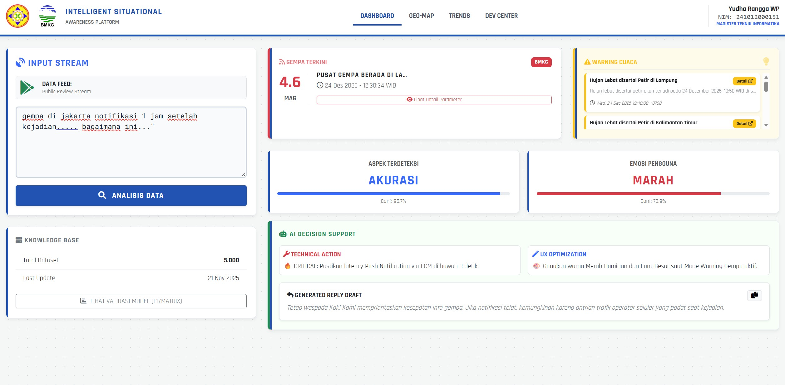
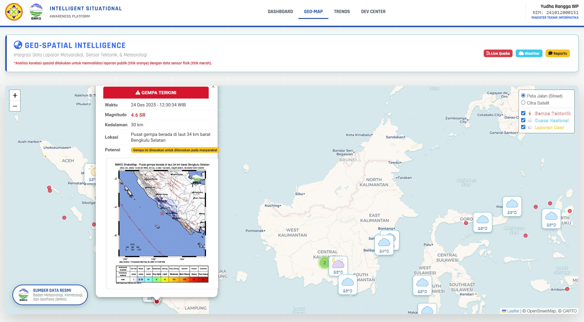
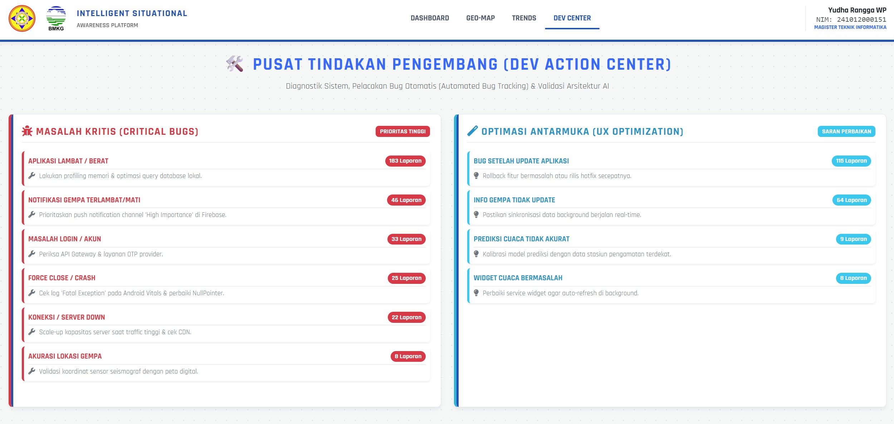

# 🌍 Intelligent Situational Awareness Platform (BMKG-INTEL)

> **Thesis Project: Magister Teknik Informatika**
>
> *Rancang Bangun Sistem Analisis Sentimen & Pemetaan Geospasial untuk Aplikasi Info BMKG menggunakan Hybrid NLP (IndoBERT & NER) dan Integrasi Data Kebencanaan Real-Time.*


---

## 📸 Galeri Sistem (System Preview)

Berikut adalah tampilan antarmuka dari sistem yang telah dikembangkan:

### 1. Dashboard Utama (Analisis Sentimen & Integrasi API)
*Memproses input teks pengguna menggunakan IndoBERT dan menampilkan data Gempa/Cuaca Real-time.*


### 2. Geo-Spatial Intelligence (Peta Sebaran)
*Validasi silang antara lokasi Laporan Warga (Oranye) dan Sensor Gempa (Merah) menggunakan NER & LeafletJS.*


### 3. Developer Action Center
*Prescriptive Analytics yang memberikan rekomendasi perbaikan teknis berdasarkan klaster keluhan.*


---

## 📖 Latar Belakang

Ribuan ulasan membanjiri aplikasi **Info BMKG** setiap harinya. Analisis manual terhadap "Big Data" ini tidak efisien dan sering melewatkan laporan kritis (seperti bug notifikasi gempa). Selain itu, tidak ada korelasi spasial untuk memvalidasi apakah keluhan pengguna benar-benar terjadi di lokasi bencana.

**BMKG-INTEL** hadir sebagai solusi **Decision Support System (DSS)** yang menggabungkan:
1.  **Kecerdasan Buatan (AI):** Memahami bahasa gaul/slang Indonesia.
2.  **Kecerdasan Lokasi (Geo-Spatial):** Memetakan posisi pelapor.
3.  **Integrasi Data Fisik:** Mengambil data sensor gempa resmi BMKG.

---

## 🚀 Fitur Unggulan

### 🧠 1. AI Engine (IndoBERT Transformer)
Menggunakan model *Pre-trained* **IndoBERT** yang di-*fine-tune* dengan 5.000 data ulasan.
- **Akurasi Tinggi (78.5%):** Jauh lebih unggul dibanding Bi-LSTM atau SVM.
- **Context-Aware:** Mampu membedakan keluhan teknis ("Gagal Login") vs laporan bencana ("Gempa kencang").

### 🗺️ 2. Geo-Spatial Intelligence
- **NER (Named Entity Recognition):** Ekstraksi otomatis nama kota dari teks (misal: "Gempa di *Bandung*").
- **Validasi Silang:** Menampilkan anomali jika ada laporan warga di lokasi yang tidak terdeteksi sensor, atau sebaliknya.
- **Multi-Layer Map:** Peta Jalan (Street) dan Citra Satelit.

### 🛠️ 3. Developer Action Center
- **Bug Radar:** Mengelompokkan isu prioritas (misal: 40 orang lapor notifikasi mati).
- **AI Recommendation:** Memberikan saran perbaikan teknis (coding suggestion) kepada developer.
- **Smart Reply:** Membuat draf balasan otomatis untuk Customer Service.

---

## 📂 Struktur Proyek

```text
BMKG-INTEL/
├── app.py                   # Entry point aplikasi Flask (Main Server)
├── requirements.txt         # Daftar dependensi pustaka Python
├── README.md                # Dokumentasi proyek
├── .gitignore               # Daftar file yang diabaikan oleh Git
│
├── screenshots/             # Galeri Tampilan Sistem
│   ├── Dashboard.jpg
│   ├── DevCenter.jpg
│   └── GeoMap.jpg
│
├── data/                    # Manajemen Data
│   ├── raw/                 # Data mentah hasil scraping (CSV)
│   └── processed/           # Data bersih siap training/analisis
│
├── models/                  # Penyimpanan Model AI (Gitignored karena besar)
│   ├── aspect_model/        # Model IndoBERT Fine-Tuned untuk Aspek
│   └── emotion_model/       # Model IndoBERT Fine-Tuned untuk Emosi
│
├── scripts/                 # Kumpulan Script Utilitas Python
│   ├── 01_train_model.py    # Script training model AI (IndoBERT)
│   ├── 03_ner_geomapping.py # Script ekstraksi lokasi (NER) untuk Peta
│   ├── 07_bug_extraction.py # Script analisis bug otomatis
│   └── 10_run_benchmark.py  # Script komparasi algoritma (Bi-LSTM vs BERT)
│
├── static/                  # File Statis (Frontend Assets)
│   ├── css/                 # Styling tampilan dashboard (Modern UI)
│   ├── js/                  # Script JavaScript tambahan
│   ├── data_map.json        # Output JSON untuk Geo-Map
│   └── bug_report.json      # Output JSON untuk Dev Center
│
├── templates/               # Template HTML (Jinja2)
│   ├── base.html            # Layout utama (Navbar, Footer)
│   ├── dashboard.html       # Halaman Utama (Analisis Teks & Widget)
│   ├── ner_map.html         # Halaman Peta Geospasial
│   ├── dev_dashboard.html   # Halaman Developer Action Center
│   └── trends.html          # Halaman Grafik Tren
│
└── utils/                   # Modul Pembantu (Helper Classes)
    ├── bmkg_api.py          # Handler koneksi ke API BMKG Real-time
    └── model_handler.py     # Logic Inferensi AI & Rekomendasi Teknis

```    
## 📦 Instalasi & Penggunaan
Ikuti langkah ini untuk menjalankan sistem di komputer lokal Anda.

1. Prasyarat
Python 3.10 atau lebih baru.

Disarankan memiliki GPU NVIDIA (CUDA) untuk performa inferensi AI yang cepat, namun CPU tetap bisa berjalan (agak lambat).

2. Clone Repositori
Bash

git clone [https://github.com/USERNAME/BMKG-Intelligent-Situational-Awareness.git](https://github.com/USERNAME/BMKG-Intelligent-Situational-Awareness.git)
cd BMKG-Intelligent-Situational-Awareness
3. Setup Environment
Bash

### Buat Virtual Environment
python -m venv venv

### Aktifkan (Windows)
venv\Scripts\activate

### Aktifkan (Mac/Linux)
source venv/bin/activate
4. Install Dependencies
Bash

pip install -r requirements.txt
5. Download / Train Model (PENTING!)
Karena file model AI terlalu besar untuk GitHub, Anda harus men-generate modelnya secara lokal pertama kali:

Bash

### Proses ini memakan waktu 30-60 menit tergantung spesifikasi PC
python scripts/01_train_model.py
Script ini akan otomatis mengunduh IndoBERT base dari HuggingFace dan melakukan Fine-Tuning.

6. Jalankan Aplikasi
Bash

python app.py
Buka browser dan akses: http://127.0.0.1:5000

### 👨‍💻 Author
Yudha Rangga WP Magister Teknik Informatika - Universitas Pamulang NIM: 241012000151

### ⚠️ Disclaimer Akademik
Aplikasi ini adalah Purwarupa Penelitian Tesis.

Data Gempa & Cuaca bersumber dari API Terbuka BMKG (Real-time).

Analisis sentimen dihasilkan oleh model AI (IndoBERT) dan mungkin memiliki margin error.

Tidak mewakili pandangan resmi instansi terkait.